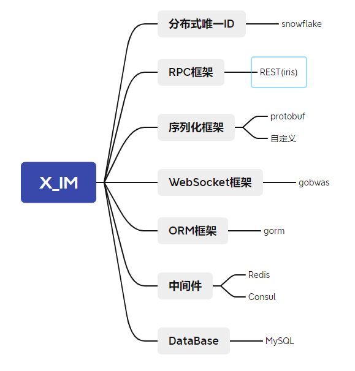

# X_IM

一个分布式即时通讯系统的框架。



## 项目启动

### docker部署相关依赖

MySQL、Redis、Consul

```bash
docker-compose -f "docker-compose.yml" up -d --build
```

### 服务启动

Gateway、Router、Logic、Occult
    
```bash
cd services
go run main.go [gateway/router/logic/occult]
```
### 项目目录结构

```bash
├─assets
│  └─data
├─container
├─examples
│  ├─benchmark
│  ├─dialer
│  ├─mock
│  └─ut
├─naming
│  └─consul
├─pkg
│  ├─logger
│  ├─middleware
│  └─token
├─services
│  ├─data
│  ├─gateway
│  │  ├─conf
│  │  └─serv
│  ├─logic
│  │  ├─conf
│  │  ├─handler
│  │  ├─client
│  │  └─server
│  ├─occult
│  │  ├─conf
│  │  ├─database
│  │  └─handler
│  └─router
│      ├─api
│      ├─conf
│      ├─data
│      └─ip
├─storage
├─tcp
├─websocket
└─wire
    ├─common
    ├─endian
    ├─pkt
    ├─protofiles
    └─rpc

```
