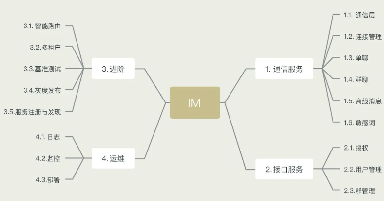

# X_IM
A distributed Instant Messaging system.

## System Layers

## Core Features of Backend System

The backend system is divided into four parts: Communication Service, Web Service, Advanced Features, and Operations.

### I. Communication Service
The Communication Service is the core component, primarily providing the following functions:

- Support for access via TCP/WebSocket protocols.

- Implementation of functions such as login, logout, and mutual account kicking.

- One-on-one chat: Direct messaging between two users.

- Group chat: Messaging among multiple users.

- Offline messaging.

- Sensitive word filtering principles and processes.

- Group management:
  - Create groups.
  - Group details.
  - Join groups.
  - Leave groups.
  - Member lists.

### II. Web Service

Main functionalities include:

- Authorization service.
- User management:
  - Create users.
  - Query details.

**Not covered**: Management of friend relationships and message send/receive permissions.

### III. Advanced Features

Due to being a long-lived distributed cluster, achieving the same level of SLA (Service Level Agreement) as HTTP services is more challenging. Advanced features include:

- Testing:
  - Unit testing: Ensuring logic reliability through coverage tests.
  - Benchmark testing: Testing the performance of login, one-on-one chat, and group chat.
- Performance optimization: System optimization in terms of memory, garbage collection, buffering, etc.
- Intelligent routing: Introduction to routing and load balancing logic for long-lived front-end services.
- Multi-tenancy: Explaining the principles of multi-tenancy implementation and service isolation.
- Gray release: Introducing the principles and practices of gray release systems.
- Deployment architecture: Discussing distributed deployment architectures and key considerations.

### IV. Operations

- Logging system
  (Filebeat, Kafka, ES, Kibana)
  - Program logs.
  - Business logs, such as login and logout events.

- Monitoring and alerting system
  (Prometheus, Grafana)
  - Machine monitoring, e.g., CPU, memory, disk usage, etc.
  - Service monitoring, e.g., online users, request duration, garbage collection, memory usage, thread count, forwarded traffic, etc.

## Core Features of the Web SDK

